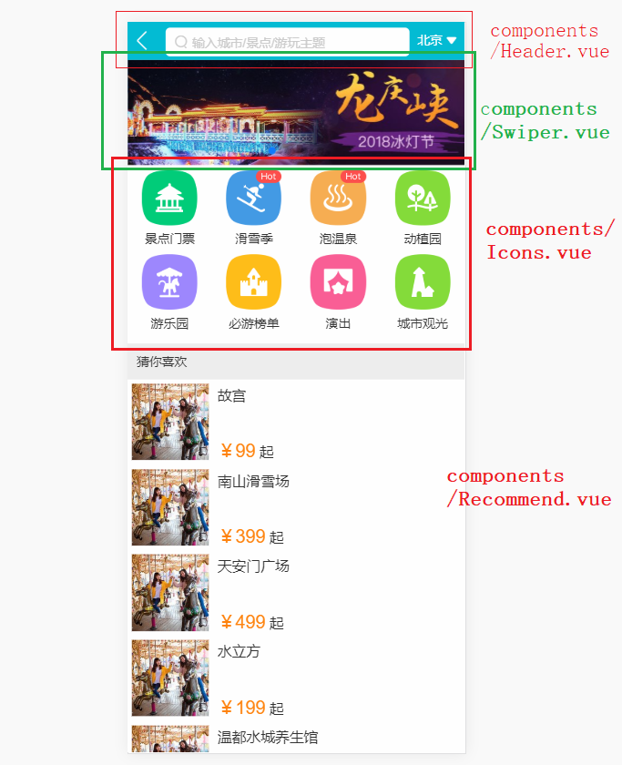
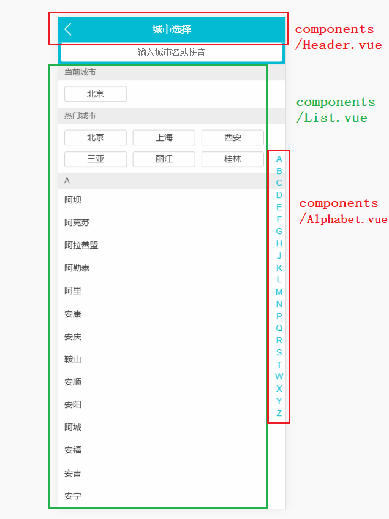
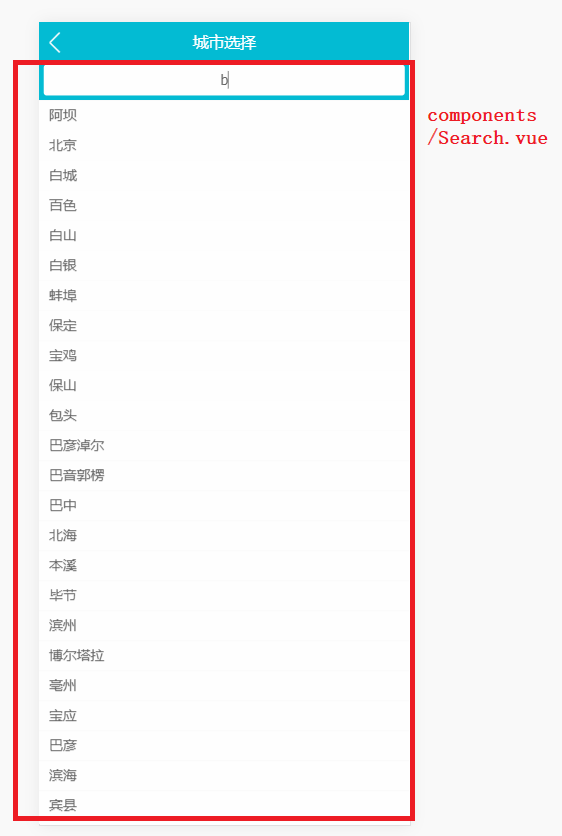

# qunar
仿照[去哪儿购票移动端](http://piao.qunar.com/touch/)部分功能
# 文档说明
1. 工具框架
2. 部署 
3. 目录结构
4. 参考资料
# 工具框架
1. Vue: Vue2.x + vue-cli + vue-router + axios + vuex
2. webpack, stylus
3. vue-awesome-swiper:轮播
4. better-scroll : 滚动条
5. fastclick: 解决移动端click事件300ms延迟
# 部署
```shell
# 安装依赖
$ npm install 

# 启动
$ npm run dev
```
浏览器调成手机模拟器，打开[http://localhost:8080/](http://localhost:8080/)

手机也可局域网通过ip访问：

ip:8080

# 目录结构
```
├─config                           // 配置项
│  │
│  ├─index.js                      //修改axios请求路径会用到
│  │
│  ├─dev.env.js                    //未了解，略
│  │
│  └─prod.env.js                   //未了解，略
│ 
├─node_modules                     // 依赖
│
├─src                              //主要内容
│  │
│  ├─assets
│  │  │ 
│  │  └─styles                     //样式
│  │     │
│  │     │─iconfont 
│  │     │
│  │     │─iconfont.css            //字体图标
│  │     │
│  │     │─border.css              //解决1像素边框
│  │     │
│  │     │─reset.css               //统一浏览器样式
│  │     │
│  │     │─mixcommon.styl          //stylus:通用样式函数
│  │     │  
│  │     └─varibles.styl           //stylus:通用样式
│  │ 
│  ├─common                        //全局公用组件
│  │  │  
│  │  │─gallarry                   //点击图片进入图片画廊（轮播）
│  │  │ 
│  │  └─fade                       //动画
│  │
│  ├─pages                         //vue组件
│  │  │  
│  │  │─city                       //见下方截图
│  │  │  
│  │  │─detail                     //点击"猜你喜欢"下的城市进入详情页
│  │  │ 
│  │  └─home                       //见下方截图  
│  │
│  ├─router                        //路由配置
│  │  │ 
│  │  └─index.js               
│  │
│  ├─store                         //vuex公用数据
│  │  │  
│  │  │─index.js
│  │  │  
│  │  │─mutations.js                      
│  │  │ 
│  │  └─state.js               
│  │
│  ├─App.vue                      //根组件
│  │ 
│  └─main.js                      //根组件初始化
│
├─static 
│  │
│  ├─data                         //测试数据
│  │
│  └─images                      //项目无关
│
│
├─package.json              
│                           
│
└─其他                      // vue-cli， webpack等生成的一些配置，注释了一部分，见各个js
   
   
```
## src/pages/home



## src/pages/city



## src/pages/city


# 参考资料
1. [vue.js](https://cn.vuejs.org/v2/guide/)官网
2. [Vue2.5开发去哪儿网App](https://coding.imooc.com/class/203.html)

